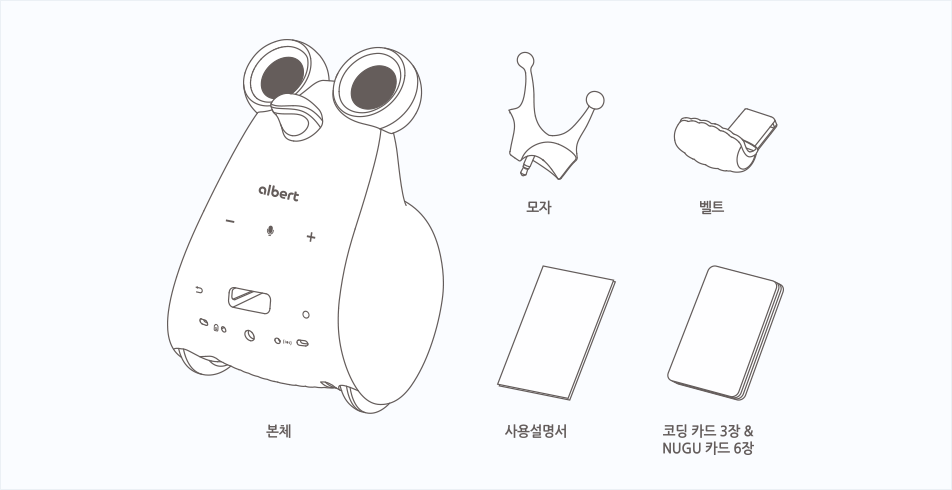
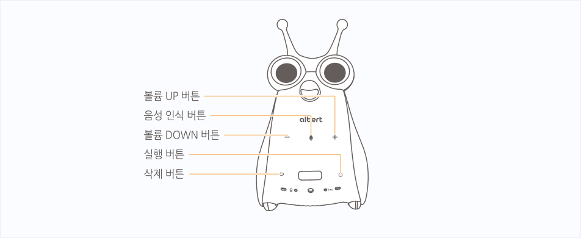
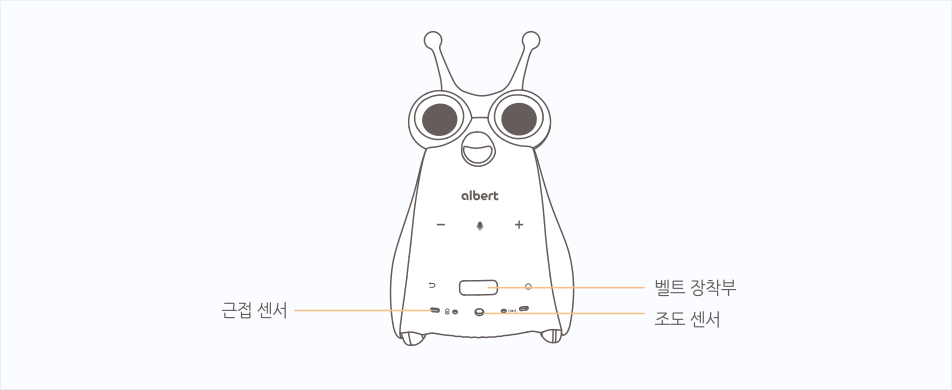
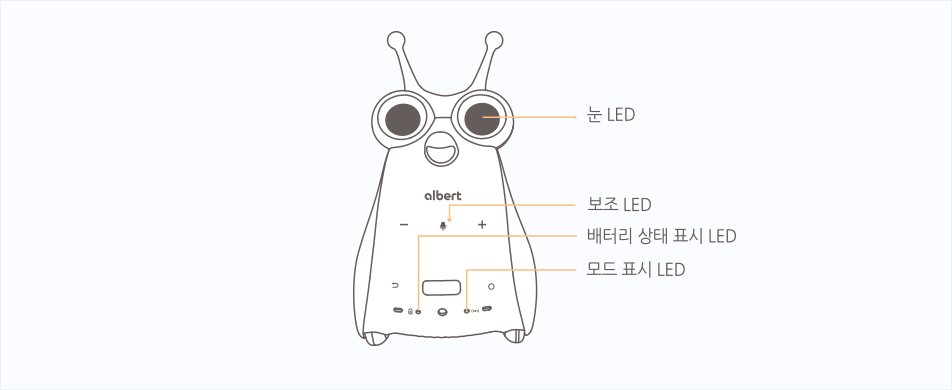
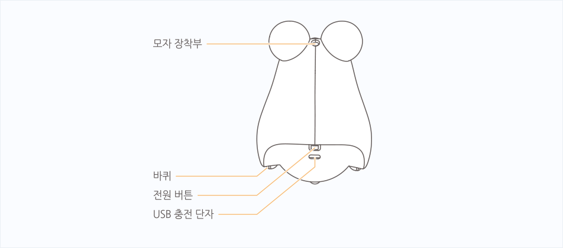
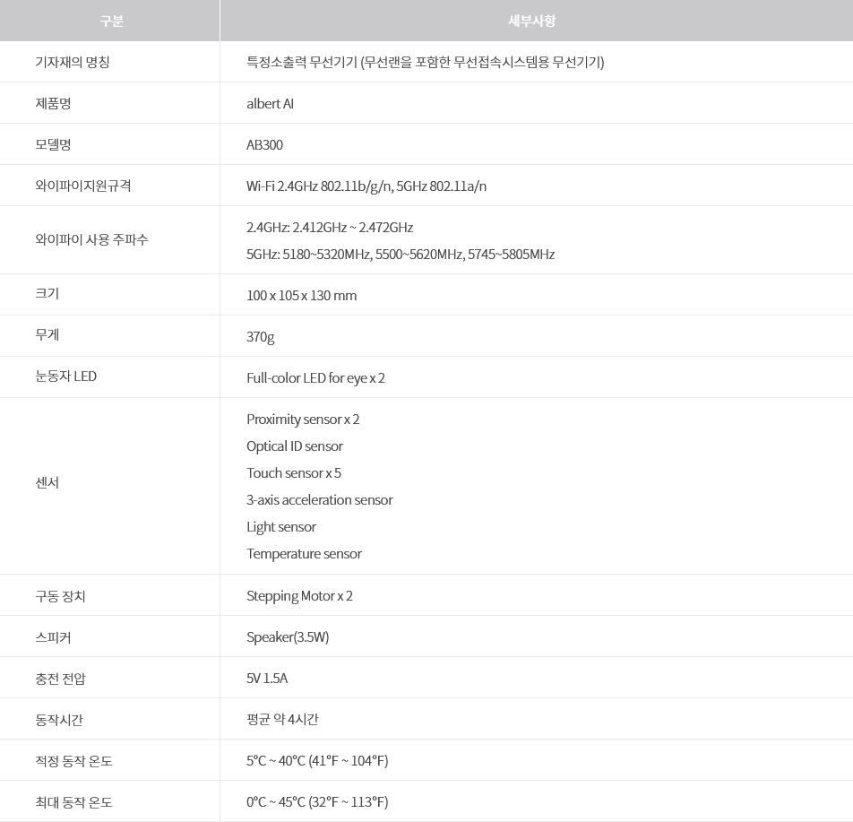

# albert AI의 HW 정보 

구성품
--
로봇 구입 시 제공되는 구성품은 아래와 같습니다.

- 알버트AI 본체 
  - 음성 인식을 통해 다양한 AI 서비스를 이용할 수 있습니다.
- 모자, 벨트
  - 알버트AI 를 보호할 수 있는 덮개입니다.
- 사용 설명서, 코딩 카드 3장 & NUGU 카드 6장
  - 품질보증서는 A/S 신청 시 필요하므로 잘 보관하시기 바랍니다.

외관 및 기능
--

- 볼륨 조절 버튼
  - 소리의 크기를 조절합니다.
- 음성인식 버튼
  - 호출어를 말하지 않아도 음성 인식을 시작합니다.
- 실행 버튼
  - 기능을 실행합니다.
- 삭제 버튼
  - 코딩 카드를 삭제합니다.
  
  

  
  
- 근접 센서
  - 거리를 감지합니다.
- 벨트 장착부
  - 벨트를 장착합니다.
- 조도 센서
  - 조도를 감지합니다.
  
  

  
  
- 눈 / 보조 LED
  - 알버트AI의 상태를 빛으로 나타냅니다.
- 배터리 상태 표시 LED
  - 배터리 상태를 빛으로 나타냅니다.
- 모드 표시 LED
  - 현재 모드를 빛으로 나타냅니다.
  
  
 
  
  
- 모자 장착부
  - 모자를 장착합니다.
- 전원 버튼
  - 전원 버튼을 좌우로 이동하면 전원이 켜집니다.
- 바퀴
  - 바퀴를 움직여 이동합니다.
- USB 충전 단자
  - USB 충전 어댑터를 연결하여 충전합니다.
  
  

  
  
- OID 센서 (광학 인식 센서)
  - 빛을 감지합니다.
- 스피커
  - 소리를 출력합니다.

로봇사양
--
로봇 하드웨어 세부사양

